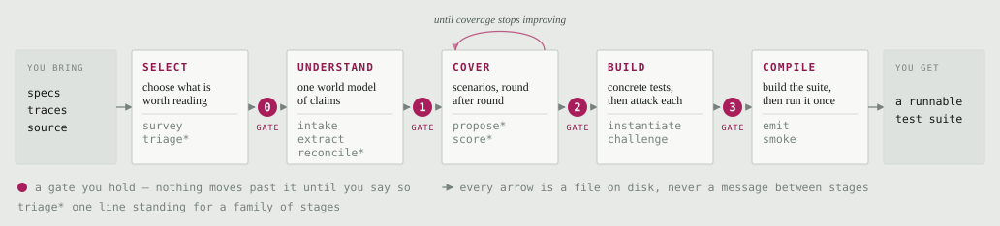

# Rubrica

Rubrica builds an agent test suite for a target system out of whatever
artifacts describe it — specifications, captured trajectories, source code —
by chaining AI skills over a schema-validated, on-disk artifact contract.

## How it works

Point Rubrica at whatever already describes your system — a specification, a
captured trajectory, a directory of source. It reads those into a single world
model of claims about what the system does, proposes scenarios that would test
those claims, turns each surviving scenario into a concrete test case, attacks
the cases to find the ones that do not hold up, and compiles the rest into a
suite you can run. You sign off at each gate below, and nothing past a gate
happens until you do.

<p align="center">
  <picture>
    <source media="(prefers-color-scheme: dark)"
            srcset="docs/assets/how-it-works-dark.svg">
    
  </picture>
</p>

Three things in that picture are worth a sentence each, because they are what
make the design unusual rather than just long:

- **Every arrow is a file on disk.** No stage is told what an earlier one
  concluded — it reads an artifact or it does not know. So each handoff is
  something you can open, schema-check, and diff between runs, which is also
  what makes a bad result attributable to one stage:
  [`docs/concepts/artifact-contract.md`](docs/concepts/artifact-contract.md).
- **Every test traces back to a claim, and every claim to your artifacts.** A
  claim carries the evidence it came from, so a test you disagree with can be
  followed back to the line that produced it:
  [`docs/concepts/glossary.md`](docs/concepts/glossary.md).
- **The gates are human, and gate 0 is different in kind from the rest.** The
  later ones ask you to review a judgment made from evidence the run already
  holds. Gate 0 decides what the run can ever know: nothing after `intake`
  reads your corpus again, so a candidate declined there is gone as completely
  as if it had never been in the corpus at all.

The stage-by-stage picture — what each stage reads, writes, and is checked by —
is [`docs/concepts/pipeline.md`](docs/concepts/pipeline.md), and
[`docs/concepts/pipeline-diagram.html`](docs/concepts/pipeline-diagram.html)
draws the same pipeline in full detail, fan-outs and barriers included.

## Status

Early. The pipeline has run end to end against a toy world with a model
dispatched at every stage, and that is the extent of what has been observed
directly — it has not yet been hardened against a real target, and several
known gaps are recorded rather than fixed. Read
[`docs/design/limitations.md`](docs/design/limitations.md) before trusting a
corner of it that has not been exercised, and
[`docs/design/rationale.md`](docs/design/rationale.md) for why it is shaped
the way it is, including the trade-offs made on purpose.

## Install

Python 3.13+ and [`uv`](https://docs.astral.sh/uv/). Nothing else: every
`rubrica` subcommand is pure Python, so a machine that can `make setup` can run
the pipeline's whole deterministic half.

```bash
make setup     # create the venv, install runtime + dev deps from uv.lock
make test      # run the test suite
make check     # ruff lint + format check, no changes
make lint      # ruff check --fix
make format    # ruff format
make help      # every target, with its one-line description
```

The two scripts under `scripts/` are the exception, because they drive a real
dispatch rather than the CLI: `dispatch-stage.sh` and `audit-reads.sh` each need
`jq` on `PATH`, and `dispatch-stage.sh` needs the `claude` CLI as well. Both
check up front and exit `2` naming the missing tool — a misconfigured
environment, not a stage defect. See
[`docs/guides/running-a-stage-by-hand.md`](docs/guides/running-a-stage-by-hand.md).

There is one more target, `make live`, deliberately not part of `make test`:
it runs behind the `live` pytest marker and the `RUBRICA_LIVE` opt-in,
asserting against committed recordings of a real dispatch, so running it
costs nothing. Producing or re-producing one of those recordings is the part
that dispatches a model and costs money.

## Quickstart

Commands below assume the venv `make setup` created is on `PATH`; otherwise
prefix each with `uv run`.

```bash
export RUN=$(rubrica intake \
  --input tests/fixtures/toy/api.json \
  --input tests/fixtures/toy/notes.md \
  --input tests/fixtures/toy/trace.json \
  --runs-dir runs --target-name toy --target-interface mcp)
rubrica validate --run "$RUN" --stage intake
rubrica check-refs --run "$RUN"
```

This mints a run from three hand-picked files and checks it clean; nothing
past `intake` runs without dispatching a model. The full walkthrough,
including the survey/triage path for a whole corpus, is
[`docs/getting-started.md`](docs/getting-started.md).

## Documentation

- [`docs/README.md`](docs/README.md) — the full index.
- [`docs/getting-started.md`](docs/getting-started.md) — a first run, start
  to finish.
- Concepts: [`docs/concepts/pipeline.md`](docs/concepts/pipeline.md),
  [`docs/concepts/artifact-contract.md`](docs/concepts/artifact-contract.md),
  [`docs/concepts/glossary.md`](docs/concepts/glossary.md).
- Reference: [`docs/reference/cli.md`](docs/reference/cli.md),
  [`docs/reference/artifacts.md`](docs/reference/artifacts.md).
- Guides:
  [`docs/guides/running-a-stage-by-hand.md`](docs/guides/running-a-stage-by-hand.md).
- Design: [`docs/design/rationale.md`](docs/design/rationale.md),
  [`docs/design/limitations.md`](docs/design/limitations.md).

## The name

Latin *rubrica* is red ochre: the pigment a scribe reached for when writing not
the text itself but the headings around it — the marks that told a reader how to
use what followed. That word is the direct ancestor of English *rubric*, which
is still the ordinary term for a scoring guide. Both senses are the job here.
Rubrica does not write the system under test; it writes the marks by which
someone else's system is read and judged, and what comes out the far end is a
rubric in the plain modern sense of the word.

The pigment being red, rather than any of the other colours a scribe had to
hand, is a coincidence — though not every reader will take it for one.

## Contributing

See [`CONTRIBUTING.md`](CONTRIBUTING.md) for the checks a change has to clear
and the commit conventions this repository holds to.

## License

Apache-2.0, © IBM Corp. See [`LICENSE`](LICENSE).
